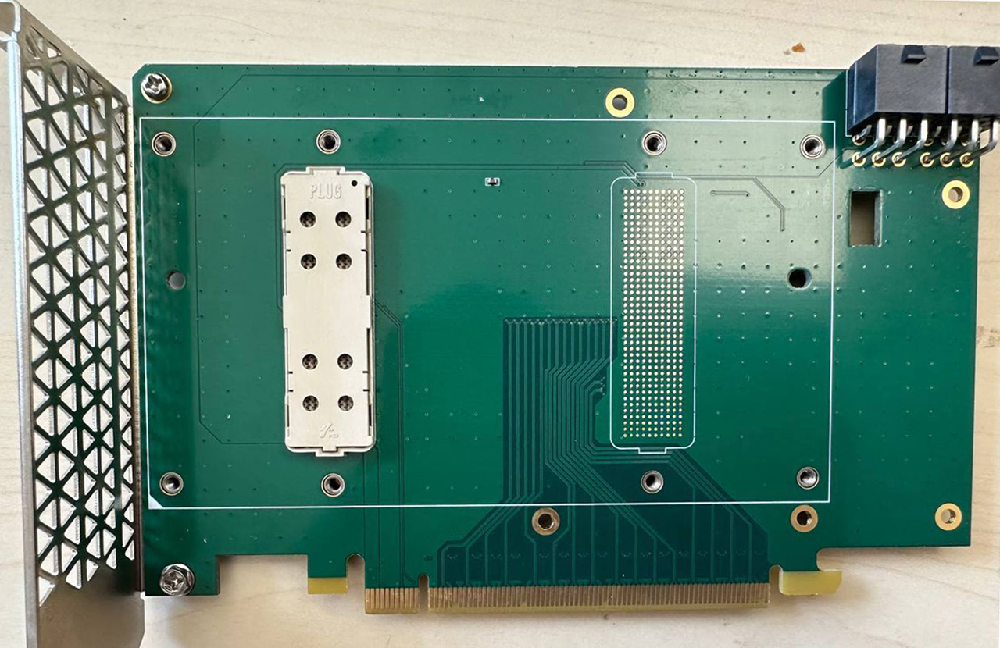
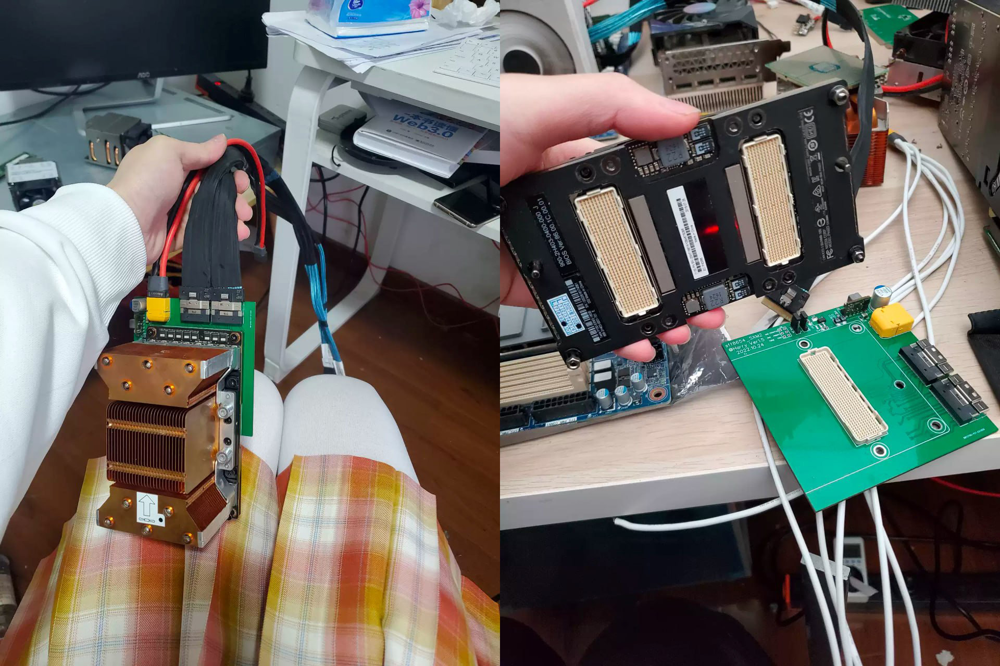
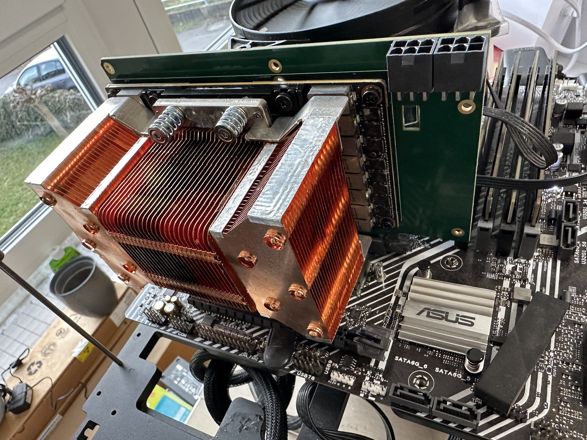
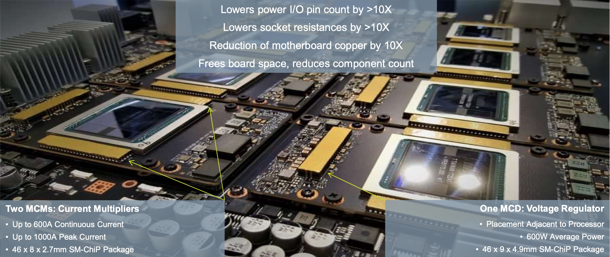
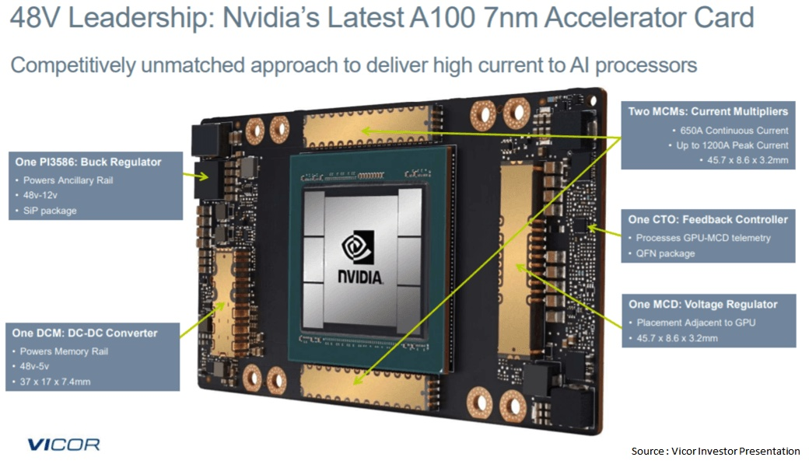
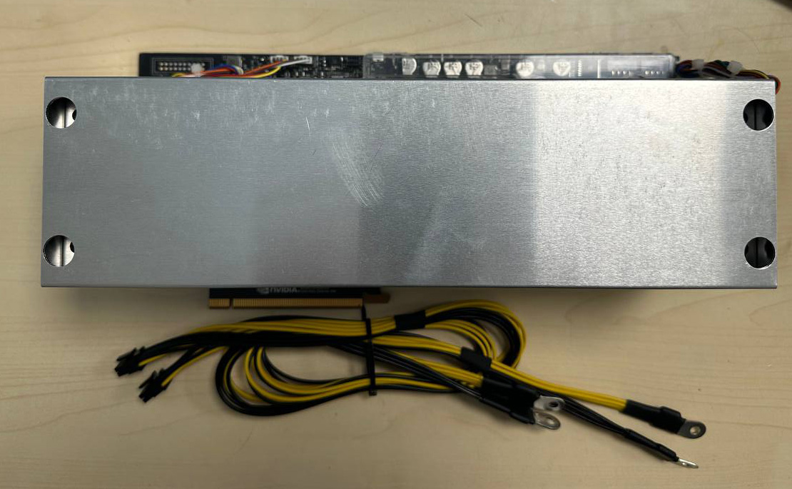
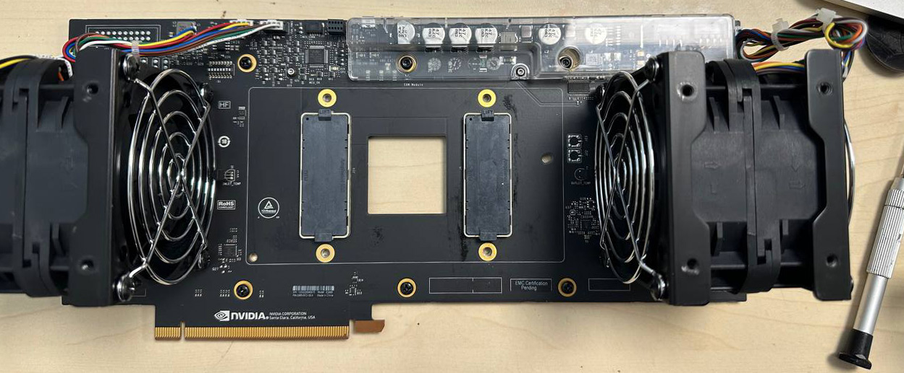
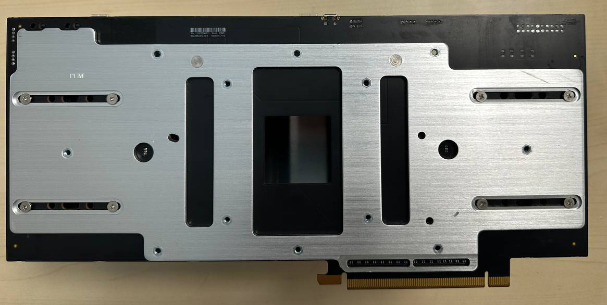
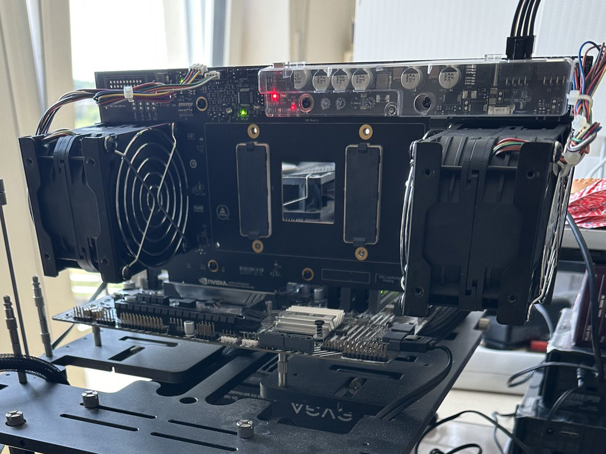
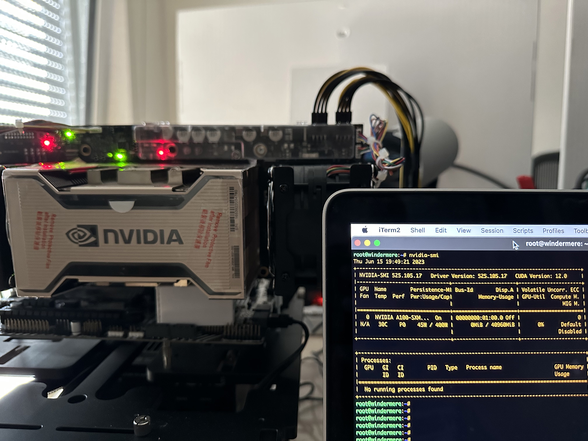

# Running SXM2/SXM3/SXM4 NVidia data center GPUs in consumer PCs

## TL;DR
SXM2/SXM3/SXM4 NVidia GPUs can be used with consumer PCs and third party servers.

## Intro

Since my original ["Building a poor man's supercomputer"](https://l4rz.net/building-a-poor-mans-supercomputer/) writeup, numerous developments have taken place. Consumer grade GPUs have significantly improved, now capable of matching the performance of data center ones. However, what alternatives are available for individuals seeking even greater speed and performance when the 24GB VRAM limit of a high-end consumer GPU, such as the 3090 or 4090, is insufficient?

If significant power consumption is not a factor, one can opt for a pair of 3090 GPUs (~$700 on eBay each). For those requiring a single GPU with more than 24GB of VRAM, professional Quadro GPUs could be an option (the Ampere RTX A6000 can be found on eBay for approximately $3000-$4000). However, consumer and professional grade NVidia GPUs often have slower GDDR6 memory than HBM2 in data center grade ones, while memory speed is frequently a significant bottleneck for ML tasks.

<!-- the HBM2 memory of the V100, despite being several years old, stil outperforms the GDDR6X memory utilized in these GPUs*.  -->

## SXM2 

Those Dell C4130 and C4140 GPU servers that come equipped with SXM2 GPUs use an interposer board to connect these GPUs to CPUs, either via a PCIE PLX switch (SXM2 board, Dell p/n `0CTHR`/`96PWG`) or directly (Dell p/n `852X8`). These boards sometimes pop up on eBay for $200 or so. The latter, sans a PCIe switch, features a dedicated 16-lane PCIe connection from each GPU to CPU so such a board could be utlizied to link a single GPU (or multiple ones) to a PC using an appropriate PCIe to Slimline SAS (`SFF-8654 8i`) adapter, in the similar manner how NVME SSDs sometimes are hooked up in the servers. However, working with this board proved to be cumbersome. Fortunately, in late 2022, an individual from the Chinese EEsphere has developed a "commercial" SXM2 to PCIe adapter. The SXM2 interface comprises two Amphenol Meg-Array connectors, with one containing all the PCIe signals and power and the another being used for, inter alia, NVLink. The adapter itself is relatively simple in design. I bought one from a person selling these on Xianyu (aka the Chinese eBay). 

*Front and back*

*A different design, pics from the seller's ad on Xianyu*

*Installed in my rig*

So for $100-200 in parts (the adapter plus a high performace heatsink) one can hook up a Tesla V100 32GB GPU to a regular desktop PC. These GPUs are currently available on eBay for approximately $900. Despite the additional effort required, it's still a viable option to obtain a 32GB GPU for a total cost of around $1000.

## SXM3 and SXM4 

Right before phasing out the Volta, NVidia has upgraded its DGX system. Eight GPUs were arranged with six NVLink switches on a GPU baseboard; two of these were connected via a midplane, forming a GPU baseboard complex. The updated SXM3 interface features a somewhat different mezzanine connector (400pin Amphenol MEG-Array used in SXM2 was swapped to a similar one that appears to be more robust) and, more importantly, an updated power delivery architecture, based on 48V power input (instead of typical 12V).

*[Source](https://vicorcorporation.gcs-web.com/static-files/e30e56ae-1dbc-4d5f-aa99-56dc2cb2b6c0)*

The 48V DC IN is fed to the MCD (Modular Current Divider) located on the GPU board. This MCD then powers the MCMs (Modular Current Multipliers), enabling a continuous delivery of 600A and peak delivery of up to 1,000A at voltages of up to 1V. Furthermore, additional DC-DC converters are employed to provide the necessary 5V for the memory rail and 12V for the ancillary rail. Those components are manufactured by Vicor.

Previously, each OEM had created its own GPU board design. The standartized modular architecture introduced in SXM3 DGX allowed NVidia to supply OEMs the assembled GPU boards, with GPUs and heatsinks pre-installed, streamlining the integration process. The same approach is used with A100 DGX/HGX platforms; the majority of OEM variants of A100 HGX utilize the NVidia the four GPU Redstone board. On A100 SXM4 GPU one can spot the same familiar Vicor MCM/MCD power delivery components.

*[Source](https://vicorcorporation.gcs-web.com/static-files/e6492f25-204e-406d-8bfe-457d195f9913)*

In order to ensure compatibility with existing 12V power delivery platforms, in their reference architecture Vicor suggests the utilization of a 12V to 48V DC-DC power converter `NBM2317`.

Servers based on the SXM3 plaform (which could be considered as a transitional to the new standartized architecture for the OEMs) are relatively uncommon on the second-hand market. To the best of my knowledge, only Supermicro and Inspur have produced the OEM version of SXM3 platform (`SYS-9029GP-TNVRT` and `NF5488M5` respectively). As a result of the restricted supply of used SXM3 servers, used 32GB SXM3 V100 GPUs are typically less expensive than SXM2 ones.

Likewise, the bulk of A100 GPUs are currently deployed in production, making SXM4 servers rather rare on the secondary market. When attaching just one or two GPUs, the four GPU GPU Redstone boards that occasionally appear on eBay can be prohibitively expensive to use. Additionally, there is no publicly accessible documentation for the Redstone platform. However, the SXM4 A100 GPUs themselves can sell for $2500-$3000 (40GB version) on eBay, and occasionally [much less as engineering samples](images/a100-eng-sample-ebay.jpg) - compared to $5000+ for PCIe version.

Being curious how to attach the more affordable (and powerful, too) SXM4 A100s to PCIe, I started to search for a solution. Around the beginning of 2023, I ran onto a post on some Chinese EE blog that featured images of an SXM4 to PCIe adaptor that appeared to be an NVidia evaluation board. I eventually [found a few of those for sale on Xianyu for ~$500 after asking around](https://h5.m.goofish.com/item?id=712945239101), so I purchased a few of those. 

The board has two counterrotating server-grade fans, an air shroud, and a solid aluminum backing plate to which a GPU is screwed. A few LEDs, an MCU, a DIP switch array, a few connections (including mini USB and JTAG), and two temperature sensors for the inlet and exhaust air are also present. Two robust 48V power cables with 8-pin Molex Micro-Fit connectors were provided by the seller as well. According to the seller, the adapter is also capable of accepting SXM3 boards. However, to accommodate an SXM3 board, one would need to remove a GPU guide pin located in a different position compared to SXM4. I haven't tried this myself.

*Adapter and cables*

*Front of the board, air shroud removed*

*Back of the board*

## Putting everything together

With this adapter, the only missing piece to connect an SXM4 A100 to a PC is the 48V power supply. The seller recommended using a separate 48V PSU powered by AC. Personally, I'm not keen on mixing different AC inputs for various voltages. The most elegant solution would involve directly powering the GPU with a suitable 48V PSU (such as Eltek or Meanwell), while using a PicoPSU-style ATX power supply to provide power to the rest of the system. This kind of ATX DC-DC power supply can convert 48V (possibly through 48V to 12V interstage) to all the required voltages for the motherboard and CPU. However, in my case, I opted for the reference Vicor solution designed for legacy 12V systems, which involves utilizing `NBM2317` (purchased for $80 from Mouser).

I mounted the NBM2317 on a makeshift breakout board and made a connection capable of carrying 40A from my workstation PSU. The `NBM2317` board was placed on top of a heatsink, with some heat pads and a flat heatpipe providing a thermal interface to dissipate the expected 10-15W of heat (according to [the datasheet](https://www.mouser.lu/datasheet/2/685/Vicor_ds_NBM2317S60E1560T0R_VICOR-1901122.pdf)). Taking it step by step, I tested everything meticulously and having connected the SXM4 board using the GPU power cables provided by the seller (18AWG, terminating with 8-pin Molex Micro-Fit connectors), I received a solid indication of "48V GOOD" LED on the SXM4 board. I then proceeded to install an `A100-SXM4-40GB` GPU, and upon booting up, it appeared to be functioning perfectly fine.

*Sans GPU*

*Everything is running*

(The setup still needs to be tidyed up, fixing everything together, adding a 12V fuse and filtering caps)

The Delta `GFC0812DS` counter-rotating fans are quite noisy and also draw a substantial amount of power, approximately 26W each when running at full RPM. Having two of these fans may seem excessive for dissipating the 400W TDP of the A100, especially considering their airflow of around 90CFM; but it should be noted that this board appears to be designed for testing purposes in a normal indoor environment, rather than in a chilling datacenter cold isle air. By flipping the #6 DIP switch, the adapter switches to a somewhat more adaptive cooling mode, where it keeps the fan RPMs and noise levels low during idle periods (the A100 consumes 50-70W while idling) and increases them under heavy loads. Nevertheless, to use this kind of setup in a personal workstation, it would make sense to convert the cooling system to a liquid-cooled one or replace the `GFC0812DS` fans with slightly larger and slower ones. 

## Conclusion

With this kind of setup, one can get a 40GB A100 working in a workstation for under $3,000 (largely depending on luck). Even though it's not a plug-and-play solution, it offers a more tempting alternative to expensive 48GB Quadro professional GPUs, especially for people like me who enjoy tinkering with hardware (including myself). It's reasonable to expect that the usual suspects will soon create and mass-produce a simpler version of the SXM4 to PCIe adaptor - effectively, a breakout board with integrated DC-to-DC power supply.

<!-- PS
An interesting aspect of the A100 is the abundance of unusual engineering samples available. For instance, there are variations such as GP-XXX-101 with 8 or 16GB of memory, as well as the GP-XXX-102 with a unique 64GB configuration. Additionally, there exists a SXM2 A100, codenamed GP199, which was utilized in certain versions of the NVIDIA DRIVE AGX Pegasus. These samples occasionally appear for sale on platforms like Xianyu (LINK). -->

## Disclaimer:
The author has no affiliation with NVidia and cannot be held responsible for any damage to equipment or harm caused. Running an unregistered GPU cluster could potentially result in severe consequences, including airstrikes on your locations.

## Written by

l4rz

## Notes

1. [The Last Inch preso by Vicor](https://site.eettaiwan.com/events/power2020/dl/presentation-04-電源傳輸-最後一哩.pdf)
2. [The seller's ad on Xianyu](https://h5.m.goofish.com/item?id=712945239101)
3. [HGX Form Factor Specification, NVidia to Open Compute Project](https://www.opencompute.org/documents/open-compute-specification-hgx-baseboard-contribution-r1-v0-1-pdf)
4. [SXM2 variant of A100, aka PG199 from NVidia DRIVE AGX Pegasus, note the chonky buck converter inductors](https://www.841973620.net:888/index.php/archives/PG199.html)